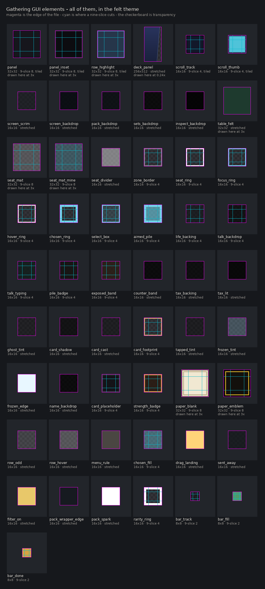

# Making a look for Gathering

Everything the mod draws is a texture. Not most of it — all of it: the felt, the mats, the
ring under the cursor, the wash over a tapped card, the rime on a frozen one, the band under a
counter, the progress bars, the blank card stock. There is no colour written in the Java. So a
look is a folder of PNGs, and making one is painting, not programming.

There are four in the box. **Felt** is the dark green table the mod ships as. **Slate** is cold
and grey. **Walnut** is warm wood and brass. **Template** is not meant to be played on: every
element is drawn as a labelled diagram so you can see what you are painting over.

## The one page to paint from



`docs/gui-elements.png` shows all fifty-five elements, at four times life size, with the name
of the file, how big it is, how it stretches, and — where it is nine-sliced — where the slices
cut. Magenta is the edge of the file. Cyan is where a nine-slice cuts. The checkerboard is
transparency.

Regenerate it after adding an element with:

```bash
python3 tools/gui_art.py
```

## What a look is made of

Two things, both in a resource pack:

```
assets/mypack/gui_themes/bubble.json
assets/mypack/textures/gui/sprites/bubble/panel.png
assets/mypack/textures/gui/sprites/bubble/panel.png.mcmeta
assets/mypack/textures/gui/sprites/bubble/…
```

The JSON is four lines:

```json
{
  "name": "Bubble",
  "sprites": "mypack:bubble",
  "order": 30
}
```

- **name** is what a player sees in Options → Video Settings. A plain word works. A
  translation key (`theme.mypack.bubble`) works too, and is better if you want the look
  translated — an untranslated key renders as itself, so either way you get something
  readable.
- **sprites** is the folder the art is in, as `namespace:folder`, under
  `textures/gui/sprites`. If you leave it out it is assumed to match the file's own name.
- **order** is where it sits in the list. Lower is earlier. Leave it out and it goes last.
  Felt is always first, because it is the one everything falls back to.

The file's own name is the look's id: `assets/mypack/gui_themes/bubble.json` is `mypack:bubble`.

## You do not have to paint all of it

A look inherits anything it does not draw. Repaint six elements and leave the other forty-nine
alone and you have a complete look — the rest comes from felt. That is worth using: a "Retro"
pass that only changes the panels, the rings and the card stock is a real look and an
afternoon's work, not a week's.

It also means a half-finished look never shows a missing texture on screen.

## Sizes and stretching

Beside each PNG is a `.mcmeta` saying how it stretches. It belongs to your look, so you can
change it:

```json
{
  "gui": {
    "scaling": {
      "type": "nine_slice",
      "width": 32, "height": 32,
      "border": 8,
      "stretch_inner": true
    }
  }
}
```

- **stretch** — the whole file is squashed to fit whatever it is drawn in. Right for flat
  washes and tints.
- **nine_slice** — the corners stay their painted size, the edges stretch along their run, and
  the middle fills. Right for anything with a border. `width` and `height` must match the PNG.
  `border` is how many pixels are corner, in texture pixels, drawn one-to-one on screen — so a
  border of 8 is an 8-pixel-thick frame however large the panel is.
- **stretch_inner: false** tiles the middle instead of stretching it. Good for a woven or
  hatched fill; costs one draw call per tile, so keep it off anything the size of a mat or a
  screen.

Higher-resolution art is fine — a 128×128 panel with a border of 32 draws a 32-pixel frame.
That is a design choice about how heavy the mod's chrome looks, not just a resolution.

## Colours are yours, with two exceptions

Two elements are painted neutral on purpose and tinted by the game, because their colour is
information rather than decoration:

- `seat_ring` — drawn in each seat's own colour, which is what makes four identical rectangles
  four players' boards.
- `rarity_ring` and `pack_spark` — the light a booster gives off, yellow for a rare and orange
  for a mythic, before any card is shown.

Paint those in white or a pale grey. Everything else takes its colour from your file.

## Trying it

Options → Video Settings → **Gathering look**. It cycles, and the change lands the instant you
press it — the screen behind the options screen repaints while you are still on the button.
The same picker is a row of the table's own menu, and the choice is saved in
`config/gathering-client.toml` on your own machine. It is never sent to a server: what a look
is is your business, not the server's.

`F3+T` reloads resource packs without restarting, which is the loop to work in: repaint, F3+T,
look.

## Checking it

```bash
python3 tools/spritecheck.py
```

Says which elements a look is missing (fine — it inherits them), which files it has that
nothing draws (usually a typo in a name), and whether any `.mcmeta` is missing.
